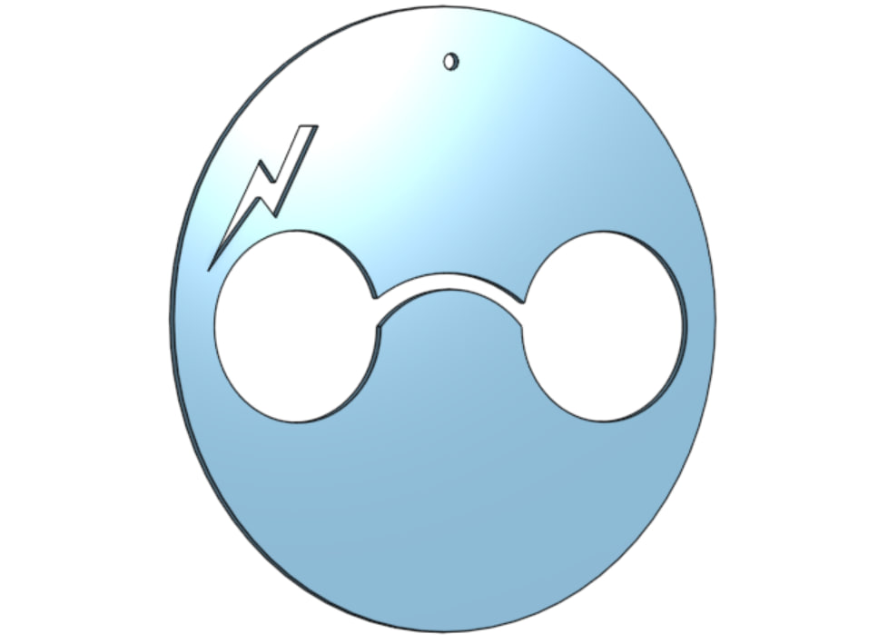

# Harry Potter Keychain

## 📌 Project Description

This project is a 3D keychain design created using **Onshape**

The design was inspired by Harry Potter and includes a circular base, round glasses, and a lightning bolt. The dimensions of the main design were estimated based on the reference image

## ✅ Requirements

The following requirements were implemented:

- Created a custom design based on a reference image
- Estimated the dimensions of the main design
- Created a circular keychain hole with a diameter of **4 mm**
- Extruded the final design to a thickness of **2 mm**
- Exported the final model in **STL** format

## 🛠️ Design Process

1. Created a new document in Onshape
2. Started a new sketch
3. Drew the main circular base
4. Drew the round glasses using circles and arcs
5. Drew the lightning bolt
6. Added a circular hole with a diameter of **4 mm** for the keychain
7. Extruded the final design to a thickness of **2 mm**
8. Exported the completed model as an **STL file**

## 🖼️ Final Design

## 🎥 Project Demo

## 🔗 Onshape Design

[View the 3D Design on Onshape](https://cad.onshape.com/documents/59ec386cc654d959d806b390/w/83d3030f1cbd5c2f75706b2e/e/a7988b2e8c6f82a39b29c0a0?renderMode=0&uiState=6a56a0a5702405fa03169c75)

## 📁 Project Files

- `Harry-Potter-Keychain.stl` — Final 3D model
- `final-design.png` — Image of the final design
- `harry-potter-keychain.gif` — Demo of the 3D model
- `README.md` — Project documentation

## 💻 Tools Used

- Onshape
- GitHub

## 👩‍💻 Author

**Aryam Aseiri**
